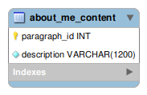

# portfolio-site

## Sample .env file 
```.env
#For Django
SECRET_KEY=actual_key

#For MySQL
NAME=actual_database_name \
USER=actual_user_name \
PASSWORD=actual_password \
HOST=actual_db_host
```
- To hide the server key and other sensitive information, I have not pushed the .env file to the repo, a similar .env file exists in my project directory.

## Database Model
- Below figures illustrate the database designs used for both the django apps (landing, projects).
### landing


### projects


## Deploying
- Deploying was done using pythonanywhere servers, following the below steps
- On the development machine, the site's functionality was tested using the localserver
- Settings required for production like, DEBUG turned to False and other security settings like https ssettings were configured in settings.py
- Using STATIC_ROOT in settings.py, Define a directory where the server collects the static files
- Push the code into github repo
```shell
#In development machine
git push <github_repo_url>
```
- Create an account in pythonanywhere.com
- Access your pythonanywhere server using a bash console, pull the repo using
```shell
#In pythonanywhere server
git pull <github_repo_url>
```
- In the pythonanywhere server create virtual env, activate it, install packages in requirements.txt
```shell
#In pythonanywhere server
virtualenv --python=/usr/bin/python3.10 <venv_name>
```
- Make migrations and migrate the changes
```shell
#In pythonanywhere server
python3 manage.py makemigrations
python3 manage.py migrate
```
- Execute python3 manage.py collectstatic
```shell
#In pythonanywhere server
python3 manage.py collecstatic
```
- Map the static folder in pythonanywhere server


- For detailed documentation check here
  1. [Deploying in pythonanywhere](https://help.pythonanywhere.com/pages/DeployExistingDjangoProject/)
  2. [Setting up staticfiles in pythonanywhere](https://help.pythonanywhere.com/pages/DjangoStaticFiles)
  3. [Setting up mysql server](https://help.pythonanywhere.com/pages/UsingMySQL/)

## Merging updates to the website
- From the development machine make the updates, test the working and push the changes to github
```shell
#In development machine
git push <github_repo_url>
```
- Inside the pythonanywhere server open a bash console, execute git pull '<github-repo-url>' this merges the changes
```shell
#In pythonanywhere server
git pull <github_repo_url>
```
- Execute python3 manage.py collectstatic if some changes are made to the static files
```shell
#In pythonanywhere server
python3 manage.py collecstatic
```
- Reload the pythonanywhere web tab